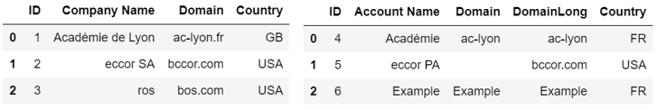
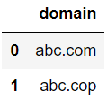
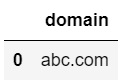
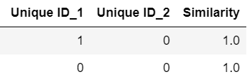

# Python Record Linkage Toolkit - Custom  Components  
This repository contains custom components that enhance the functionality of the [Python Record Linkage Toolkit](https://github.com/J535D165/recordlinkage), a powerful library for record linkage and deduplication tasks. The toolkit already provides essential tools for indexing, comparing records, and using classifiers. However, to address specific requirements for a quick record linkage POC, I've developed additional components to achieve more accurate and faster results.
Custom components for 

## POC Requirements

1. Find the best match for each record based on several features.
2. Improve the accuracy compared to the existing tool.
3. Enhance the processing speed compared to the existing tool.

During my tests, I encountered two main challenges:  
### Indexing

One of the critical steps in the record linkage process is indexing, which involves building candidate pairs for comparison (blocking). The chosen indexing method directly impacts the linkage performance. My classification use case falls under the large-scale category with a dataset size of 2K x 200K = 400M records (categorized as small < 1M, medium > 1M, and large scale > 10M, as described in [this source](https://bmcmedinformdecismak.biomedcentral.com/articles/10.1186/1472-6947-14-23)).

I encountered limitations with the built-in indexing algorithms provided by the toolkit. Some methods, such as Full Index (Cartesian product), were too slow for my POC, while others like Blocking and Sorted Neighborhood resulted in decreased accuracy.

### Solution: Custom Indexer - PrefixMatch

To overcome the indexing challenges, I developed a custom Indexer called [PrefixMatch](/index.py) indexer. This indexer creates record pairs only if there is at least one pair of input corresponding columns that have the same prefix. This approach significantly reduced the number of possible matches, resulting in a much faster process without compromising accuracy.

For instance, let's compare the results with the default algorithms using the following datasets:

- **Full Index** -> [(1,4)(1,5)(1,6),(2,4),(2,5),(2,6),(3,4),(3,5),(3,6)] – 9 pairs (Cartesian product)
- **Blocking** (on Company Name column) –>  [] - empty set
- **Prefix Match (1st letter)** (Company Name to Account Name, Domain to Domain Long) –> [(1,4),(2,5),(2,6),(3,5)]
- **Sorted Neighborhood** (Column=Company Name, Window size =2) -> [(1,4),(2,5),(3,6)]

You can observe the different results obtained from each indexing method, each with its own impact on performance and accuracy. The Full Index approach yields all 400M record pairs, making it impractical for my POC's performance requirement. On the other hand, choosing blocking indexing on a specific column can lead to the loss of valid available options, which affects the accuracy.

### Comparing

Another challenge lies in comparing records with multiple potential matches and determining the best match. The toolkit provides the ability to set a threshold for similarity comparison. However, the default behavior of returning either 1 or 0 does not allow distinguishing the best match when multiple options exceed the threshold.

**For example**   
Let's consider two Dataframes displayed below:  
      
To assess the similarity between records, I set a threshold of 80% for domain matching.  
As a result, I obtained the following comparison output:  
  
However, the challenge lies in determining which match is superior; the available information only indicates that they both met the threshold requirement. In reality, the 2nd record in the results is a better match than the 1st (with a similarity score of 1.000000 compared to 0.857143).

### Solution: Custom String Comparison

To address this issue, I have overridden the existing String compare, and added the ability to return the similarity value. Now, I can still use the default behavior of the algorithm or reset to 0 only those values that fall below the threshold.

These custom components have significantly enhanced the performance and accuracy of my record linkage process POC, effectively meeting all the specified requirements.
By using the [Python Record Linkage Toolkit](https://github.com/J535D165/recordlinkage) in conjunction with these custom enhancements, I was able to achieve superior results.

Please feel free to explore the code and documentation in this repository to understand the implementation of the custom components and how they can be utilized for your own record linkage projects. If you have any questions or feedback, don't hesitate to reach out!
